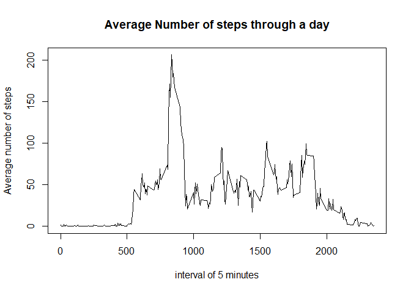

## Loading and preprocessing the data

```r
unzip('activity.zip')
activity <- read.csv("activity.csv")
```

## What is mean total number of steps taken per day?

```r
total_steps_per_day <- aggregate(activity$steps, by=list(activity$date), FUN=sum)
hist(total_steps_per_day$x, 
     xlab='Total Steps per Day', 
     main ='Histogram of Total Steps per Day')
```

<!-- -->

```r
mean_step <- mean(total_steps_per_day$x,na.rm=TRUE)
median_steps <- median(total_steps_per_day$x,na.rm=TRUE)
```

The mean number of steps per day is 1.0766189\times 10^{4}  
The median number of steps per day is 10765

## What is the average daily activity pattern?

```r
mean_steps_per_interval <- aggregate(activity$steps, by=list(activity$interval), na.rm=TRUE, FUN=mean)
Max_interval <- mean_steps_per_interval[mean_steps_per_interval$x == max(mean_steps_per_interval$x),]
plot( mean_steps_per_interval, 
      type = 'l', 
      xlab='interval of 5 minutes', 
      ylab='Average number of steps', 
      main='Average Number of steps through a day')
```

<!-- -->

1. Note that this graph includes jumps from the 55 minute to the following hour with an interval of 55 units instead of 5

2. The interval with the maximum average number of steps every day is at 835

## Imputing missing values

```r
missing_rows_count <- sum(!complete.cases(activity))

# to fill the missing values
# 1) separate the data into two sets
#       a. complete_rows
#       b. missing_rows
# 2) loop through the missing rows and replace the NA with the average for the interval
# 3) recombine the complete_rows with the filled_rows into a new dataframe
# continue with reports

complete_rows <- activity[complete.cases(activity),]
missing_rows <- activity[!complete.cases(activity),]

mean_steps <- function(interval) {
        return( mean_steps_per_interval[mean_steps_per_interval$Group.1 == interval,2])
}
        
missing_rows$steps <- mapply(interval=missing_rows$interval, FUN=mean_steps)  

activity_missing_filled <- rbind(complete_rows, missing_rows)

#generate histogram and calculate mean and median
total_steps_per_day_filled <- aggregate(activity_missing_filled$steps, 
                                        by=list(activity_missing_filled$date), FUN=sum)
hist(total_steps_per_day_filled$x, 
     xlab='Total Steps per Day', 
     main ='Histogram of Total Steps per Day with Filled Missing Data')
```

<!-- -->

```r
mean_step_filled <- mean(total_steps_per_day_filled$x,na.rm=TRUE)
median_steps_filled <- median(total_steps_per_day_filled$x,na.rm=TRUE)
```

1. The number of rows with missing values is 2304  

2. Strategy to replace missing values:  

        1) separate the data into two sets  
                a. complete_rows  
                b. missing_rows  
        2) loop through the missing rows and replace the NA with the average for the interval using mapply
        3) recombine the complete_rows with the filled_rows into a new dataframe 

3. The new dataset will filled data is called **activity_missing_filled**

4. A histogram of the data with filled missing values is displayed above

The mean number of steps per day with the filled dataset is 1.0766189\times 10^{4}  
The median number of steps per day with the filled dataset is 1.0766189\times 10^{4}

Note that the mean and median values remain largely unchanged - and have converged after filling empty data.
The two histograms have the same shape, but the counts are higher for the histogram that includes the missing values.

## Are there differences in activity patterns between weekdays and weekends?


```r
activity_missing_filled$day_of_week <- weekdays(as.Date(activity_missing_filled$date, "%Y-%m-%d"))

is_weekend <- function( day_of_week) {
        if (day_of_week == 'Sunday' | day_of_week == 'Saturday')
                return('weekend')
        else
                return('weekday')
}
activity_missing_filled$day_type <- mapply(day_of_week=activity_missing_filled$day_of_week, FUN=is_weekend)
activity_missing_filled$day_type <- as.factor(activity_missing_filled$day_type)

mean_steps_per_interval_day_type <- aggregate(activity_missing_filled$steps, 
                                              by=list(activity_missing_filled$interval, 
                                                      activity_missing_filled$day_type), 
                                              na.rm=TRUE, FUN=mean)
mean_steps_per_interval_day_type$Group.2 <- as.factor(mean_steps_per_interval_day_type$Group.2)

library(lattice)
xyplot(x ~ Group.1|Group.2, 
       data = mean_steps_per_interval_day_type, 
       type='l', 
       layout=c(1,2), 
       xlab='interval of 5 minutes', 
       ylab='Average number of steps', 
       main='Average Number of steps through a day')
```

<!-- -->

1. A new factor is created called **day_type**

2. A lattice plot shows the average number of steps in the weekday and in the weekend.

The two plots show that during a weekday, there is a higher average step count in the morning around 8am.  
On the weekend, however, there is an overall higher average step count through the rest of the day.


